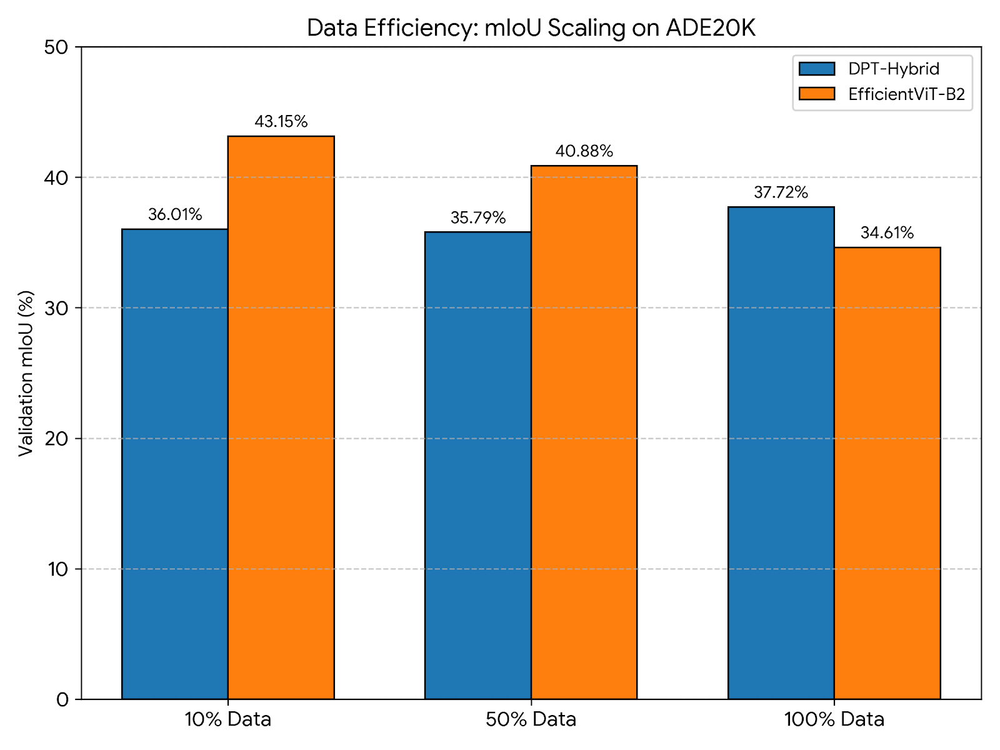

# Efficient Vision Transformers: Dense Prediction Paradigms
**Direction 3: Decoder Reassembly vs. Native Redesign**

This repository contains the code, training logs, and evaluation metrics for assessing the deployment viability of Vision Transformers for dense prediction tasks (Semantic Segmentation) under restricted compute environments.

##  Objective
To investigate whether native architectural redesign for dense prediction (**EfficientViT-B2**) offers a better accuracy-efficiency trade-off and data scaling properties than a decoder-only reassembly model (**DPT-Hybrid**).

##  Model Architectures
1. **DPT-Hybrid (Dense Prediction Transformer)**
   * **Paradigm:** Decoder-only reassembly.
   * **Backbone:** ResNet50 + ViT-Base (`vitb_rn50_384`).
   * **Strategy:** Leverages a heavy encoder and reassembles tokens into multi-scale feature maps in the decoder.
2. **EfficientViT-B2**
   * **Paradigm:** Native Multi-Scale Redesign.
   * **Strategy:** Replaces standard softmax attention with ReLU linear attention and utilizes Cascaded Group Attention (CGA) to optimize memory bandwidth.

##  Experiments & Data Efficiency
Both architectures were fine-tuned on the **ADE20K** scene parsing dataset (150 classes) across three data regimes to evaluate generalization from limited data:
* **10% Split** (2,021 images)
* **50% Split** (10,105 images)
* **100% Split** (20,210 images)

*Training Constraints:* 10 Epochs, Kaggle T4 GPU (16GB VRAM), strict disk-streaming dataloaders to prevent RAM OOM.

##  Results

###  Analysis & Insights (Q&A)

#### Architectural Behavior
**Q: Why did DPT-Hybrid require the full 100% dataset to reach its peak (37.72% mIoU), while EfficientViT-B2 generalized so well (43.15% mIoU) on just 10% of the data?**
> **A:** DPT relies heavily on the self-attention mechanism of its Vision Transformer backbone. Standard ViTs are notoriously "data-hungry" because they lack the strong inductive biases (like translation equivariance and locality) found in standard convolutions. They require massive amounts of data to learn spatial relationships. EfficientViT uses a hybrid approach with convolutional priors and a multi-scale linear attention mechanism. These built-in biases allow EfficientViT to learn spatial hierarchies much faster, generalizing well even on the 10% split.

**Q: Why did EfficientViT-B2's performance appear to degrade (to 34.61% mIoU) when trained on 100% of the data?**
> **A:** This is an artifact of the evaluation setup under strict compute constraints. For the 10% run, the model was evaluated against 500 validation batches (a large, representative sample). For the 100% run, due to Kaggle's 12-hour session limit, the validation fraction was reduced (`val_fraction=0.1`), evaluating against only 50 batches (a tiny, 200-image subset). This smaller subset presented a significantly harder evaluation metric, skewing the final number downward and highlighting the necessity of static validation sets when analyzing scaling laws.

#### Engineering & Implementation
**Q: How did the data pipeline handle the System RAM Out-Of-Memory (OOM) crashes on the 20,210-image 100% dataset split?**
> **A:** Initial implementations cached uncompressed PIL images and NumPy arrays to RAM (`precache=True`), which maxed out the 30GB CPU RAM limit on the Kaggle host and caused kernel death. We re-engineered the `ADE20K_Robust_Dataset` class to strictly stream from disk. To prevent the GPU from idling during disk reads, we heavily optimized the PyTorch DataLoader, using `num_workers=4`, `pin_memory=True`, `prefetch_factor=2`, and `persistent_workers=True` to parallelize disk I/O and maintain high GPU utilization.

**Q: How was the legacy DPT-Hybrid architecture adapted to run on modern PyTorch 2.x hardware?**
> **A:** The official ISL-Org DPT implementation relies on an older version of `timm` (PyTorch Image Models) that violently clashes with PyTorch 2.x. We implemented a clean-room environment setup that downgraded `timm` to `0.4.12` to preserve the original `vitb_rn50_384` backbone logic. Furthermore, DPT requires a strict `[0.5, 0.5, 0.5]` tensor normalization, completely failing if fed the standard ImageNet `[0.485, 0.456, 0.406]` mean/std that EfficientViT uses. We built distinct, isolated dataset transformers for each model to ensure mathematical compatibility.

**Q: Why was DPT-Hybrid forced to use a batch size of 2, while EfficientViT could handle larger batches?**
> **A:** DPT-Hybrid's architecture (ResNet50-ViT-Base encoder + complex reassembly decoder) creates a massive memory footprint that quickly maxes out the 16GB VRAM of a T4 GPU. EfficientViT specifically mitigates this memory bottleneck. By replacing quadratic softmax attention with linear attention and using Cascaded Group Attention (CGA) to reduce redundancy across heads, it fundamentally lowers memory bandwidth usage. This allowed EfficientViT to comfortably process larger batch sizes, proving that memory efficiency dictates real-world training throughput far more than theoretical FLOPs.

**Q: How did you manage Kaggle's strict 12-hour execution limit for the 100% data runs?**
> **A:** To prevent the host OS from terminating the training loop unpredictably, we implemented a fail-safe session timer (`max_session_hours=11.5`). The loop continuously checks the elapsed time against the epoch clock. If the 11.5-hour threshold is breached, the script safely halts gradients, flushes the VRAM, and triggers a hard checkpoint save (`model.state_dict()`, optimizer state, scaler state) so the run could be seamlessly resumed in a fresh container.

##  How to Run
The code is provided in Kaggle-ready Jupyter Notebooks:
1. `actual-dpt-hybrid (1).ipynb` - Contains the environment setup, timm downgrades, and disk-streaming loops for DPT.
2. `efficient-vit (1).ipynb` - Contains the EfficientViT architecture integration and optimized training configuration.

##  Authors
* Gorripati Parthav Chandraditya
* Abhiram Reddy Pasam
* B. Tanmay
* P. Naga Siva Sankar
* L. Mohnish
